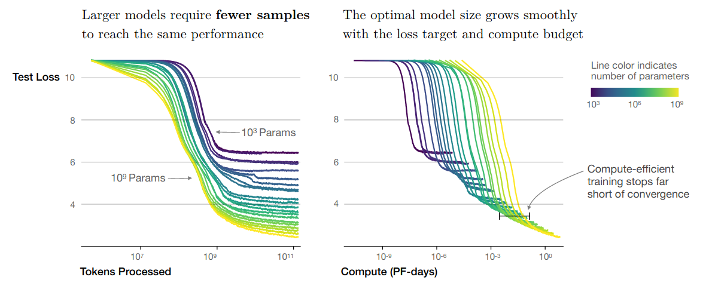
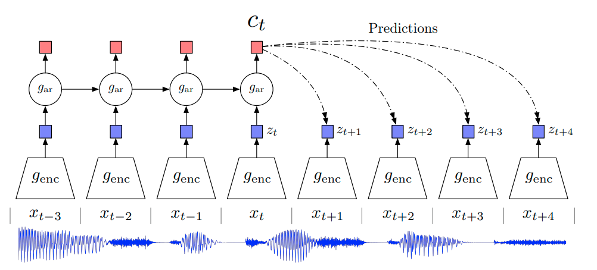
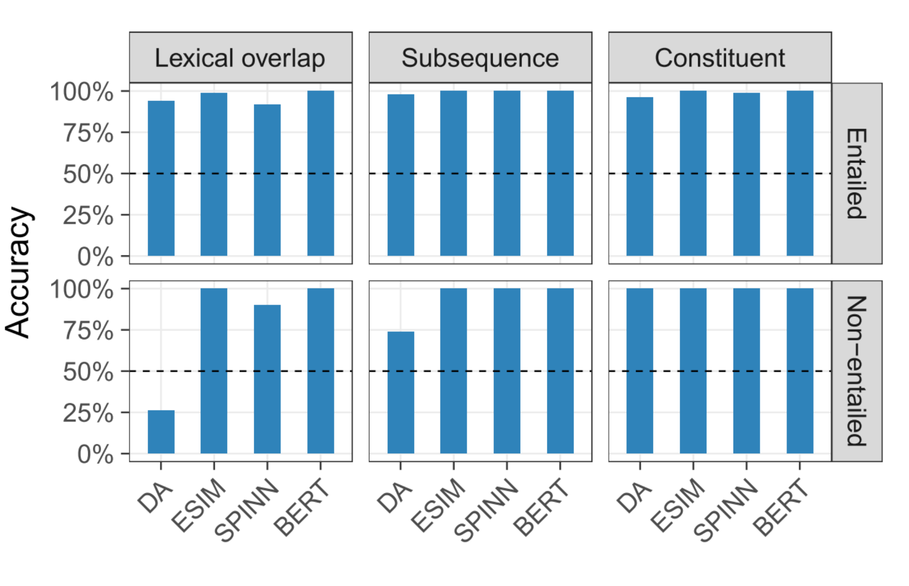
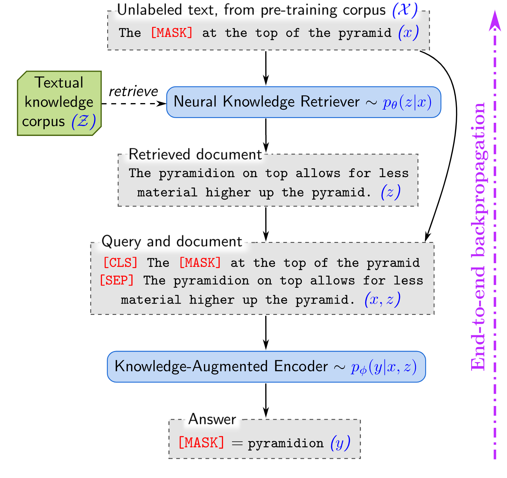
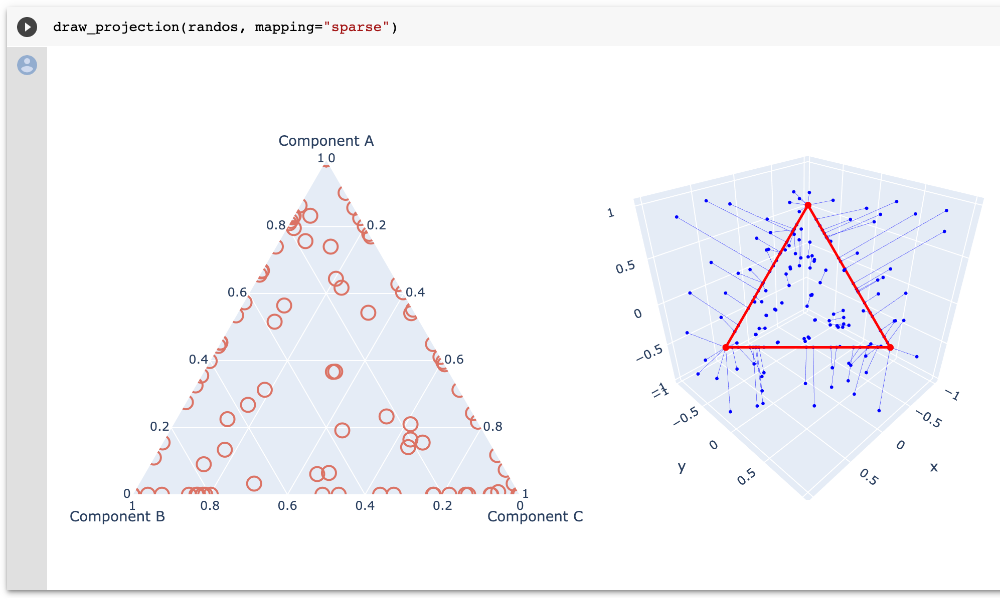

# Awesome NLP Paper Discussions

Each week, the Hugging Face team has a science day where one team member presents an awesome NLP paper. We've decided to share this discussion with the community. See [planned future discussions](#planned-discussions) below.

#### March 24, 2020
- **Paper**: [Scaling Laws for Neural Language Models](https://arxiv.org/abs/2001.08361)
- **Authors**: Jared Kaplan, Sam McCandlish, Tom Henighan, Tom B. Brown, Benjamin Chess, Rewon Child, [Scott Gray](https://twitter.com/scottgray76), [Alec Radford](https://twitter.com/AlecRad), Jeffrey Wu, Dario Amodei
- **Presenter**: [Teven Le Scao](https://twitter.com/Fluke_Ellington)
- **Discussion**: [Google doc paper tutorial](https://docs.google.com/document/d/1Rye61octaEF6FPHN3E7Bn2s-W3AWgMi1hukxrbkBmgY/edit#heading=h.s0a83j1o76km)

#### March 17, 2020
- **Paper**: [Representation Learning with Contrastive Predictive Coding](https://arxiv.org/abs/1807.03748) 
- **Authors**: [Aaron van den Oord](https://twitter.com/avdnoord), Yazhe Li, Oriol Vinyals
- **Presenter** [Patrick von Platen](https://twitter.com/PatrickPlaten)
- **Discussion**: [Slides](https://docs.google.com/presentation/d/1qxt7otjFI8iQSCpwzwTNei4_n4e4CIczC6nwy3jdiJY/edit?usp=sharing)

#### March 10, 2020
- **Paper**: [Right for the Wrong Reasons: Diagnosing Syntactic Heuristics in Natural Language Inference
](https://arxiv.org/abs/1902.01007)
- **Authors**: [R. Thomas McCoy](https://twitter.com/RTomMcCoy), Ellie Pavlick, [Tal Linzen](https://twitter.com/tallinzen)
- **Presenter**: [Victor Sanh](https://twitter.com/sanhestpasmoi)
- **Discussion**: [Slides](https://docs.google.com/presentation/d/15waw0-rr4RmPx0dhEzhNhkSiFnNqhvjm66IufWbRLyw/edit?usp=sharing)

#### March 3, 2020
- **Paper**: [REALM: Retrieval-Augmented Language Model Pre-Training](https://arxiv.org/abs/2002.08909)
- **Authors**: [Kelvin Guu](https://twitter.com/kelvin_guu), [Kenton Lee](https://twitter.com/kentonctlee), Zora Tung, [Panupong Pasupat](https://twitter.com/IcePasupat), [Ming-Wei Chang](https://twitter.com/mchang21)
- **Presenter**: [Joe Davison](https://twitter.com/joeddav)
- **Discussion**: [Write-up](https://joeddav.github.io/blog/2020/03/03/REALM.html)

#### February 25, 2020
- **Paper**: [Adaptively Sparse Transformers](https://arxiv.org/abs/1909.00015) 
- **Authors**: Gonçalo M. Correia, [Vlad Niculae](https://twitter.com/vnfrombucharest), André F.T. Martins
- **Presenter**: [Sasha Rush](https://twitter.com/srush_nlp)
- **Discussion**: [Colab notebook](https://colab.research.google.com/drive/1EB7MI_3gzAR1gFwPPO27YU9uYzE_odSu)

### Planned Discussions

#### March 31, 2020
- **Paper**: [Compositionality decomposed: how do neural networks generalise?](https://arxiv.org/abs/1908.08351)
- **Authors**: [Dieuwke Hupkes](https://twitter.com/_dieuwke_), Verna Dankers, Mathijs Mul, Elia Bruni
- **Presenter**: [Thomas Wolf](https://twitter.com/Thom_Wolf)
