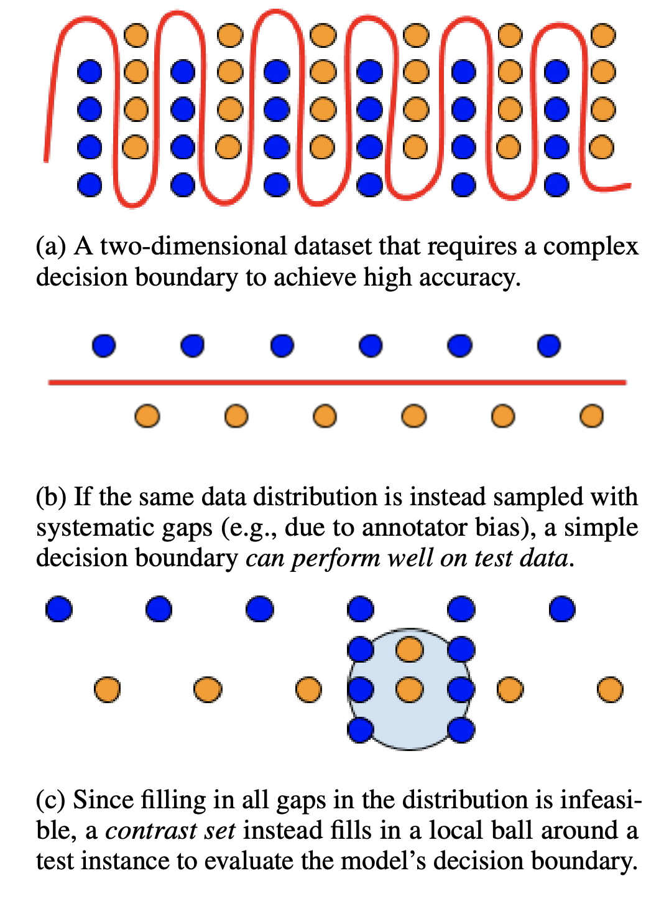
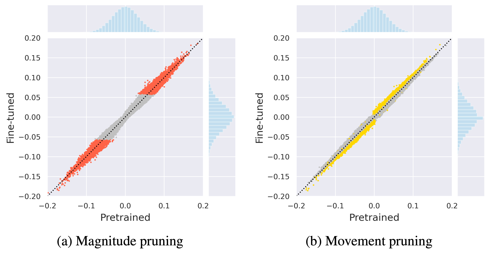
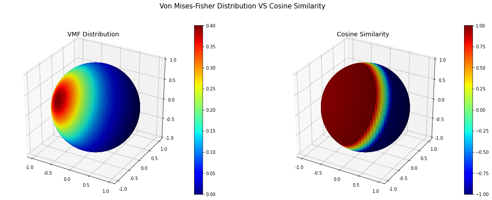
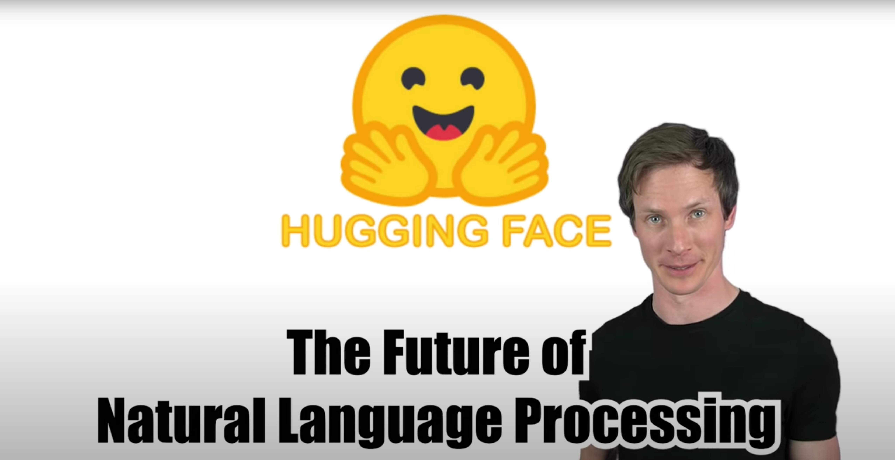
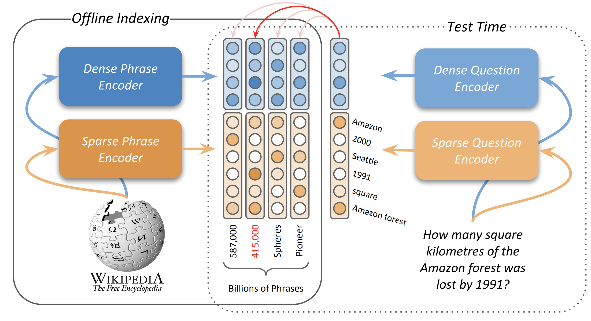

# Awesome NLP Paper Discussions

The Hugging Face team believes that we can reach our goals in NLP by building powerful open source tools and by conducting impactful research. Our team has begun holding regular internal discussions about awesome papers and research areas in NLP. In the spirit of open science, we've decided to share these discussion materials with the community.

_Note: These science day discussions are held offline with no physical presentation or discussion to provide. However, some presentation materials do include limited comments from our team or summaries of internal discussions._

See [planned future discussions](#planned-discussions) below.

#### June 9, 2020
- **Paper**: [MEvaluating NLP Models via Contrast Sets](https://arxiv.org/abs/2004.02709)
- **Authors**: [Matt Gardner](https://twitter.com/nlpmattg), [Yoav Artzi](https://twitter.com/yoavartzi), Victoria Basmova, [Jonathan Berant](https://twitter.com/JonathanBerant), [Ben Bogin](https://twitter.com/ben_bogin), [Sihao Chen](https://twitter.com/soshsihao), [Pradeep Dasigi](https://twitter.com/pdasigi), [Dheeru Dua](https://twitter.com/ddua17), [Yanai Elazar](https://twitter.com/yanaiela), Ananth Gottumukkala, [Nitish Gupta](https://twitter.com/yanaiela), [Hanna Hajishirzi](https://twitter.com/HannaHajishirzi), [Gabriel Ilharco](https://twitter.com/gabriel_ilharco), [Daniel Khashabi](https://twitter.com/DanielKhashabi), [Kevin Lin](https://twitter.com/nlpkevinl), Jiangming Liu, [Nelson F. Liu](https://twitter.com/nelsonfliu), Phoebe Mulcaire, [Qiang Ning](https://twitter.com/qiangning), [Sameer Singh](https://twitter.com/sameer_), [Noah A. Smith](https://twitter.com/nlpnoah), [Sanjay Subramanian](https://twitter.com/sanjayssub), [Reut Tsarfaty](https://twitter.com/rtsarfaty), [Eric Wallace](https://twitter.com/Eric_Wallace_), Ally Zhang, [Ben Zhou](https://twitter.com/BenZhou96)
- **Presenter**: [Victor Sanh](https://twitter.com/SanhEstPasMoi)
- **Discussion**: [Slides](https://docs.google.com/presentation/d/1DfA2xi0JBSbqQ0hJrhI0jzANwjSaxV7odOA73lPfHjo/edit?usp=sharing)

#### May 18, 2020
- **Paper**: [Movement Pruning: Adaptive Sparsity by Fine-Tuning](https://arxiv.org/abs/2005.07683)
- **Authors**: [Victor Sanh](https://twitter.com/SanhEstPasMoi), [Thomas Wolf](https://twitter.com/Thom_Wolf), [Alexander M. Rush](https://twitter.com/srush_nlp)
- **Presenter**: [Victor Sanh](https://twitter.com/SanhEstPasMoi)
- **Discussion**: [Slideshare](https://www.slideshare.net/VictorSanh/movement-pruning-explain-like-im-five-234205241)

#### May 5, 2020
- **Paper**: [Von Mises-Fisher Loss for Training Sequence to Sequence Models with Continuous Outputs](https://arxiv.org/abs/1812.04616) 
- **Authors**: [Sachin Kumar](https://twitter.com/shocheen), Yulia Tsvetkov
- **Presenter**: [Victor Sanh](https://twitter.com/SanhEstPasMoi)
- **Discussion**: [Colab notebook](https://colab.research.google.com/drive/1040xlv5WkLo_Xli0FpA2_bxyfsMouZ-w)

#### April 22, 2020
- **Topic**: Transfer Learning in Natural Language Processing (NLP): Open questions, current trends, limits, and future directions
- **Presenter**: [Thomas Wolf](https://twitter.com/Thom_Wolf)
- **Discussion**: [Video](https://www.youtube.com/watch?v=G5lmya6eKtc)

#### April 7, 2020
- **Topic**: Overview of recent work on: Indexing and Retrieval for Open Domain Question Answering
- **Presenter**: [Yacine Jernite](https://twitter.com/YJernite)
- **Discussion**: [Slides](https://docs.google.com/presentation/d/1A5wJEzFYGdNem7egJ-BTm6EMI3jGNe1lalyChYL54gw)

#### March 24, 2020
- **Paper**: [Scaling Laws for Neural Language Models](https://arxiv.org/abs/2001.08361)
- **Authors**: Jared Kaplan, Sam McCandlish, Tom Henighan, Tom B. Brown, Benjamin Chess, Rewon Child, [Scott Gray](https://twitter.com/scottgray76), [Alec Radford](https://twitter.com/AlecRad), Jeffrey Wu, Dario Amodei
- **Presenter**: [Teven Le Scao](https://twitter.com/Fluke_Ellington)
- **Discussion**: [Google doc paper tutorial](https://docs.google.com/document/d/1Rye61octaEF6FPHN3E7Bn2s-W3AWgMi1hukxrbkBmgY/edit#heading=h.s0a83j1o76km)

#### March 17, 2020
- **Paper**: [Representation Learning with Contrastive Predictive Coding](https://arxiv.org/abs/1807.03748) 
- **Authors**: [Aaron van den Oord](https://twitter.com/avdnoord), Yazhe Li, Oriol Vinyals
- **Presenter** [Patrick von Platen](https://twitter.com/PatrickPlaten)
- **Discussion**: [Slides](https://docs.google.com/presentation/d/1qxt7otjFI8iQSCpwzwTNei4_n4e4CIczC6nwy3jdiJY/edit?usp=sharing)

#### March 10, 2020
- **Paper**: [Right for the Wrong Reasons: Diagnosing Syntactic Heuristics in Natural Language Inference
](https://arxiv.org/abs/1902.01007)
- **Authors**: [R. Thomas McCoy](https://twitter.com/RTomMcCoy), Ellie Pavlick, [Tal Linzen](https://twitter.com/tallinzen)
- **Presenter**: [Victor Sanh](https://twitter.com/SanhEstPasMoi)
- **Discussion**: [Slides](https://docs.google.com/presentation/d/15waw0-rr4RmPx0dhEzhNhkSiFnNqhvjm66IufWbRLyw/edit?usp=sharing)

#### March 3, 2020
- **Paper**: [REALM: Retrieval-Augmented Language Model Pre-Training](https://arxiv.org/abs/2002.08909)
- **Authors**: [Kelvin Guu](https://twitter.com/kelvin_guu), [Kenton Lee](https://twitter.com/kentonctlee), Zora Tung, [Panupong Pasupat](https://twitter.com/IcePasupat), [Ming-Wei Chang](https://twitter.com/mchang21)
- **Presenter**: [Joe Davison](https://twitter.com/joeddav)
- **Discussion**: [Write-up](https://joeddav.github.io/blog/2020/03/03/REALM.html)

#### February 25, 2020
- **Paper**: [Adaptively Sparse Transformers](https://arxiv.org/abs/1909.00015) 
- **Authors**: Gonçalo M. Correia, [Vlad Niculae](https://twitter.com/vnfrombucharest), André F.T. Martins
- **Presenter**: [Sasha Rush](https://twitter.com/srush_nlp)
- **Discussion**: [Colab notebook](https://colab.research.google.com/drive/1EB7MI_3gzAR1gFwPPO27YU9uYzE_odSu)

### Planned Discussions

_Nothing planned for the moment, check back soon!_
